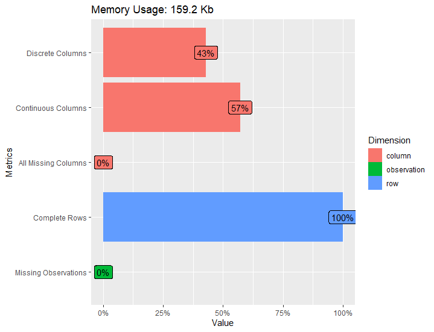
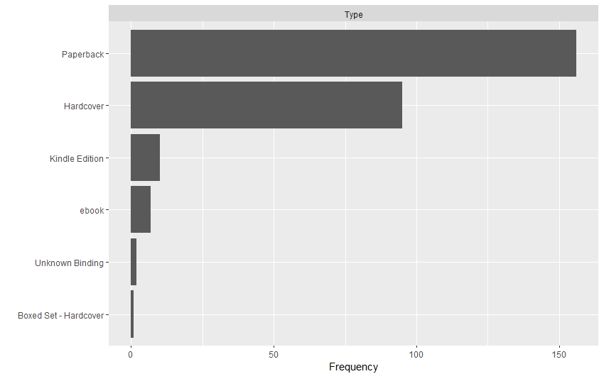

# R-Assignment 4

**Created by Nutwara Boonyangkongkaew (ID: 63130500035)**

Choose Dataset:
Top 270 Computer Science / Programing Books (Data from Thomas Konstantin, [Kaggle](https://www.kaggle.com/thomaskonstantin/top-270-rated-computer-science-programing-books)) >> [Using CSV](https://raw.githubusercontent.com/safesit23/INT214-Statistics/main/datasets/prog_book.csv)

### Outlines
1. Explore the dataset
2. Learning function from Tidyverse
3. Transform data with dplyr and finding insight the data
4. Visualization with GGplot2

## Part 1: Explore the dataset

```
# Install the packages
install.packages("dplyr", "readr", "ggplot2", "DataExplorer", "stringr", "tidyverse", "forcats")  

# Activate the packages
library(dplyr) 
library(readr)  
library(ggplot2) 
library(DataExplorer) 
library(stringr)
library(tidyverse)                          
library(forcats)

# Load dataset
comsci <- read_csv("https://raw.githubusercontent.com/safesit23/INT214-Statistics/main/datasets/prog_book.csv")
```


In this dataset has a list of 270 books in the field of computer science and programming related topics.<br>
with rating, reviews, book title, description, number of pages, type, and price that dataset has 271 rows 7 columns.<br>

The list of books was constructed using many popular websites <br>
which provide information on book ratings of all the book in those websites the 270 most popular were selected.<br>


| No. | Variable              | Data Type   |
|:---:|-------------------|--------------|
|1.   |Rating| double|
|2.   |Reviews |number|
|3.   |Book_title| character|
|4.   |Description |character|
|5.   |Number_Of_Pages |double|
|6.   |Type |character|
|7.   |Price |double|


```
# see dataset overview 'comsci'     
glimpse(comsci)     # preview the dataset
summary(comsci)     # result summaries of various model fitting functions  
introduce(comsci)   # explain the details of the dataset 
```
Result:
```
Rows: 271
Columns: 7
$ Rating          <dbl> 4.17, 4.01, 3.33, 3.97, 4.06, 3.84, 4.09, 4.15, 3.87, 4.62, 4.03, 3.78, 3.73, 3.87, 3.87, 3.95, 3.8~
$ Reviews         <dbl> 3829, 1406, 0, 1658, 1325, 117, 5938, 1817, 2093, 0, 160, 481, 33, 1255, 593, 417, 80, 279, 370, 20~
$ Book_title      <chr> "The Elements of Style", "The Information: A History, a Theory, a Flood", "Responsive Web Design Ov~
$ Description     <chr> "This style manual offers practical advice on improving writing skills. Throughout, the emphasis is~
$ Number_Of_Pages <dbl> 105, 527, 50, 393, 305, 288, 256, 368, 259, 128, 352, 352, 200, 328, 240, 288, 392, 304, 336, 542, ~
$ Type            <chr> "Hardcover", "Hardcover", "Kindle Edition", "Hardcover", "Kindle Edition", "Paperback", "Hardcover"~
$ Price           <dbl> 9.323529, 11.000000, 11.267647, 12.873529, 13.164706, 14.188235, 14.232353, 14.364706, 14.502941, 1~

     Rating         Reviews        Book_title        Description        Number_Of_Pages      Type               Price        
 Min.   :3.000   Min.   :   0.0   Length:271         Length:271         Min.   :  50.0   Length:271         Min.   :  9.324  
 1st Qu.:3.915   1st Qu.:   5.5   Class :character   Class :character   1st Qu.: 289.0   Class :character   1st Qu.: 30.751  
 Median :4.100   Median :  35.0   Mode  :character   Mode  :character   Median : 384.0   Mode  :character   Median : 46.318  
 Mean   :4.067   Mean   : 185.6                                         Mean   : 475.1                      Mean   : 54.542  
 3rd Qu.:4.250   3rd Qu.: 116.5                                         3rd Qu.: 572.5                      3rd Qu.: 67.854  
 Max.   :5.000   Max.   :5938.0                                         Max.   :3168.0                      Max.   :235.650  

# A tibble: 1 x 9
   rows columns discrete_columns continuous_columns all_missing_columns total_missing_values complete_rows total_observations memory_usage
  <int>   <int>            <int>              <int>               <int>                <int>         <int>              <int>        <dbl>
1   271       7                3                  4                   0                    0           271               1897       163072
```


### Explore dataset with graphs in RStudio.

#### Dataset details
```
comsci %>% plot_intro()
```
<p align="center">
  
</p>

<p align="center">รูปที่ 1 คำอธิบายชุดข้อมูล
</p>

จากกราฟเห็นได้ว่า
- variable ข้อมูลแบบไม่ต่อเนื่อง --> 43%  
- variable ข้อมูลแบบต่อเนื่อง --> 57%
- column ทั้งหมดมี missing values --> 0%
- จำนวน row / ข้อมูลสมบูรณ์ --> 100% 
- missing observation value ขาดหายไป --> 0%

แสดงว่า ไม่มีการสูญหายของชุดข้อมูล / ชุดข้อมูลครบถ้วนสมบูรณ์

#### Check the distribution and density of the data.
#### For numeric variables

```
comsci %>% plot_density()
comsci %>% plot_histogram()  
```
<p align="center">

</p>

<p align="center">
รูปที่ 2 กราฟแสดงการกระจายของข้อมูลด้วย density plot
</p>

<p align="center">

</p>

<p align="center">
รูปที่ 3 กราฟแสดงการกระจายของข้อมูลด้วย histogram plot
</p>

#### For character variables 
only retrieve columns >= 50 categories.
```
comsci %>% plot_bar() 
```

<p align="center">

</p>

<p align="center">
รูปที่ 4 กราฟแท่งแสดงปริมาณของข้อมูลเชิงคุณภาพ
</p>


#### Finding Relationships

```
comsci %>% plot_correlation() 
```

<p align="center">

</p>

<p align="center">
รูปที่ 5 กราฟแสดงความสัมพันธ์ของชุดข้อมูล
</p>

Non-numeric group data cannot be correlated.

--> use one-hot encoding.

--> making it possible to see all the relationships of various variable.


## Part 2: Transform data with dplyr and finding insight the data

1. หาราคาเฉลี่ยของหนังสือแต่ละประเภท


```
comsci %>% group_by(Type) %>% select(Price) %>% summarise(avg = mean(Price, na.rm = TRUE))
```


Result:
```
# A tibble: 6 x 2
  Type                    avg
  <chr>                 <dbl>
1 Boxed Set - Hardcover 220. 
2 ebook                  51.4
3 Hardcover              70.1
4 Kindle Edition         32.4
5 Paperback              45.8
6 Unknown Binding        37.2
```
จากโจทย์ได้ใช้ command ดังต่อไปนี้ <br>

`group_by` --> นำ data frame และ variables (<i>Type</i>) มาจัดกลุ่ม <br>

`select()` --> เลือกใช้ variable ที่ชื่อว่า <i>Price</i>                   <br>

`summarise()` --> ทำการสรุปค่าเฉลี่ยของ <i>Price</i>               <br>

ได้ใจความว่า หาราคาเฉลี่ยแล้วทำการจัดกลุ่มด้วยประเภทของหนังสือ โดยแสดงข้อมูลของประเภทและราคาเฉลี่ยของหนังสือออกมา


2. หนังสือเล่มไหนบ้างที่มีตั้งแต่ 1500 หน้าขึ้นไป


```
comsci %>% select(Book_title, Number_Of_Pages)%>% filter(Number_Of_Pages >= 1500);
```


Result:
```
# A tibble: 2 x 2
  Book_title                                                                    Number_Of_Pages
  <chr>                                                                                   <dbl>
1 The Linux Programming Interface: A Linux and Unix System Programming Handbook            1506
2 The Art of Computer Programming, Volumes 1-4a Boxed Set                                  3168
```

จากโจทย์ได้ใช้ command ดังต่อไปนี้  <br>

`select()` --> เลือกใช้ variable ที่ชื่อว่า <i>Book_title</i>, <i>Number_Of_Pages</i>             <br>

`filter()` --> ระบุเงื่อนไขไว้ว่า จำนวนหน้าของหนังสือ <i>Number_Of_Pages</i> มีมากกว่าหรือเท่ากับ 1500    <br>

ได้ใจความว่า หาหนังสือที่มีจำนวนหน้าไม่ต่ำกว่า 1500 หน้า โดยแสดงข้อมูลชื่อและจำนวนหน้าของหนังสือออกมา


3. หนังสือประเภทใดที่มีจำนวนมากที่สุด


```
comsci %>% count(Type, sort = TRUE) %>% head(n = 1L);
```


Result:
```
# A tibble: 1 x 2
  Type          n
  <chr>     <int>
1 Paperback   156
```

จากโจทย์ได้ใช้ command ดังต่อไปนี้  <br>

`count()` --> นับจำนวนข้อมูลตามกลุ่มตัวแปรที่ระบุไว้ (<i>Type</i>) <br>

`head()` --> แสดงผลออกมาตามจำนวนที่ระบุไว้    <br>

ได้ใจความว่า หาว่าหนังสือประเภทใดมีจำนวนมากที่สุด โดยระบุมาเพียงประเภทเดียว

4. บอกรายละเอียดของหนังสือที่มี rating มากที่สุุด


```
comsci %>% filter(Rating == max(Rating));
```


Result:
```
# A tibble: 1 x 7
  Rating Reviews Book_title              Description                                            Number_Of_Pages Type  Price
   <dbl>   <dbl> <chr>                   <chr>                                                            <dbl> <chr> <dbl>
1      5       0 Your First App: Node.js "A tutorial for real-world application development us~             317 ebook  25.9
```

จากโจทย์ได้ใช้ command ดังต่อไปนี้  <br>

`filter()` --> ระบุเงื่อนไขไว้ว่า หา <i>Rating</i> ที่มีมากที่สุด    <br>

ได้ใจความว่า หารายละเอียดทั้งหมดของหนังสือที่มี rating มากที่สุุด  


5. เรียงจำนวนการดูของหนังสือประเภท e-book ในลำดับจากน้อยไปมาก

```
comsci %>%  filter(Type=="ebook") %>% dplyr::select(Book_title,Type,Reviews) %>% arrange(Reviews)
```


Result:
```
# A tibble: 7 x 3
  Book_title                                      Type  Reviews
  <chr>                                           <chr>   <dbl>
1 Your First App: Node.js                         ebook       0
2 Practical Foundations for Programming Languages ebook       3
3 From Mathematics to Generic Programming         ebook      18
4 Algorithms Unlocked                             ebook      33
5 Effective Programming: More Than Writing Code   ebook      57
6 Deep Learning                                   ebook      88
7 Learn You a Haskell for Great Good!             ebook     161
```

จากโจทย์ได้ใช้ command ดังต่อไปนี้  <br>

`filter()` --> ระบุเงื่อนไขไว้ว่า หา <i>Type</i> ที่ชื่อว่า "ebook"    <br>

`select()` --> เลือกใช้ variable ที่ชื่อว่า <i>Book_title</i>, <i>Type</i> และ <i>Reviews</i>  <br>

`arrange()` --> เปลี่ยนลำดับ row ของ <i>Reviews</i> โดยเรียงจากน้อยไปหามาก    <br>

ได้ใจความว่า หาหนังสือประเภท e-book โดยแสดงข้อมูลชื่อ, ประเภทและจำนวนการดูของหนังสือซึ่งเรียงลำดับจำนวนการดูจากน้อยไปมาก


6. เปลี่ยนชื่อ variable จาก Description เป็น Explanation


```
rename(comsci, Explanation = Description)   # rename column 
```


Result:
```
# A tibble: 271 x 7
   Rating Reviews Book_title                       Explanation                                Number_Of_Pages Type    Price
    <dbl>   <dbl> <chr>                            <chr>                                                <dbl> <chr>   <dbl>
 1   4.17    3829 The Elements of Style            "This style manual offers practical advic~             105 Hardco~  9.32
 2   4.01    1406 The Information: A History, a T~ "James Gleick, the author of the best sel~             527 Hardco~ 11   
 3   3.33       0 Responsive Web Design Overview ~ "In Responsive Web Design Overview For Be~              50 Kindle~ 11.3 
 4   3.97    1658 Ghost in the Wires: My Adventur~ "If they were a hall of fame or shame for~             393 Hardco~ 12.9 
 5   4.06    1325 How Google Works                 "Both Eric Schmidt and Jonathan Rosenberg~             305 Kindle~ 13.2 
 6   3.84     117 The Meme Machine                 "What is a meme? First coined by Richard ~             288 Paperb~ 14.2 
 7   4.09    5938 Start with Why: How Great Leade~ "Why do you do what you do?\n\nWhy are so~             256 Hardco~ 14.2 
 8   4.15    1817 Algorithms to Live By: The Comp~ "A fascinating exploration of how insight~             368 Hardco~ 14.4 
 9   3.87    2093 Weapons of Math Destruction: Ho~ "A former Wall Street quant sounds an ala~             259 Hardco~ 14.5 
10   4.62       0 ZX Spectrum Games Code Club: Tw~ "This book is ideal for ZX Spectrum fans ~             128 Paperb~ 14.6 
# ... with 261 more rows
```

จากโจทย์ได้ใช้ command ดังต่อไปนี้  <br>

`rename()` --> เปลี่ยนชื่อ variable ของ <i>Description</i> เป็น <i>Explanation</i>    <br>

โดยมี syntax ว่า new_name = old_name;   <br>

ได้ใจความว่า ให้เปลี่ยนชื่อ column จาก "Description" เป็น "Explanation"


## Part 3: Visualization with GGplot2
### 1.) Graph show relation between price and number of page.
```
scat_plot1 <- comsci %>% filter(pages<=500) %>% ggplot(aes(x=Price,y=Number_Of_Pages))+
  geom_point(aes(color=Type))

scat_plot1+geom_smooth(method="lm")
```
Result:

<p align="center">
  
</p>

<p align="center">รูปที่ 6 Scatter Plot (Positive Correlation)
</p>


จากกราฟเห็นได้ว่า มีความสัมพันธ์เชิงเส้น(เชิงบวก)ระหว่างสองตัวแปร  <br>
เมื่อตัวแปร X (Price) เพิ่ม, ตัวแปร Y (Number_Of_Page) ก็จะเพิ่มขึ้นด้วย (X เป็นสัดส่วนโดยตรงกับ Y)  <br>

แสดงว่า ราคายิ่งสูง จำนวนหน้าของหนังสือก็มีมากขึ้นเรื่อย ๆ <br>

<b>เพิ่มเติม</b> บทความเกี่ยวกับนิยาม Scatter Plot : [ที่นี่](https://ichi.pro/th/scatter-plot-kheruxng-mux-sahrab-sthiti-cheing-phrrnna-5185213788052)<br>

### 2.) Graph show relation between price and rating.
```
ggplot(data = comsci,
       mapping = aes(x = Price, y = Rating, color = Type)) +
  geom_line() +                   # add a line graph style
  geom_point() +                  # add a graph style as a point
  facet_wrap(vars(Type)) +        # grouped into category
  theme_bw()                      # make a grid
```
Result:

<p align="center">
  
</p>

<p align="center">รูปที่ 7 สร้างกราฟจาก GGplot2 
</p>


กราฟได้แบ่งเป็นหมวดหมู่ แยกเป็นสีตามประเภทของหนังสือ  <br>
ทั้งนี้ยังแสดงความสัมพันธ์ระหว่าง Rating และ Price ของหนังสือ  <br>

ซึ่งได้มาจากคำถามที่ว่า Rating ของหนังสือแต่ละประเภทมีความสัมพันธ์กับราคาของหนังสืออย่างไร ?  <br>
คำตอบที่ได้คือ ไม่มีความตายตัว   <br>
โดย หนังสือที่มีราคาถูกกว่าก็สามารถมี Rating สูงกว่า หนังสือที่มีราคาแพงกว่าได้  <br>
และหนังสือที่มีราคาถูกกว่าก็สามารถมี Rating ต่ำกว่า หนังสือที่มีราคาแพงกว่าได้  <br>
แล้วหนังสือที่ราคาใกล้เคียงกันก็มี Rating ที่ต่างกันหรือใกล้เคียงกันได้  <br>

ทั้งนี้การกระจายและความหนาแน่นของเส้นกราฟสามารถประเมินปริมาณความมากน้อยของหนังสือแต่ละประเภทได้  <br>
บ่งบอกได้ว่า Paperback มีจำนวนมากที่สุด รองลงมาคือ Hardcover, Kindle Edition, ebook, Unknown Binding และ Boxed Set - Hardcover ตามลำดับ  <br>


## Part 4: Using command from tidyverse (e.g. stringr, forcats)
stringr
```
A <- "INT214 Statistics for IT"
str_to_lower(A)
str_to_upper(A)
str_length(A)

str_c("I", "LOVE", "214")

x <- c("gigabyte", "elegent", "together","Anyway")
str_sub(x,0,1)
```

Result:
```
[1] "int214 statistics for it"
[1] "INT214 STATISTICS FOR IT"
[1] 24

[1] "ILOVE214"

[1] "g" "e" "t" "A"
```


forcats
```
comsci %>%
  mutate(Type = fct_infreq(Type)) %>%
  ggplot(aes(x = Type)) + 
  geom_bar(aes(color=Type)) + 
  coord_flip()
```

Result:

<p align="center">
  
</p>

<p align="center">รูปที่ 8 สร้างกราฟจาก forcats package 
</p>


## Part 5: Creating Interaction Dashboard with BI Tools

[Power BI: Top 270 Computer Science / Programing Books](https://www.google.co.th/?gws_rd=ssl)