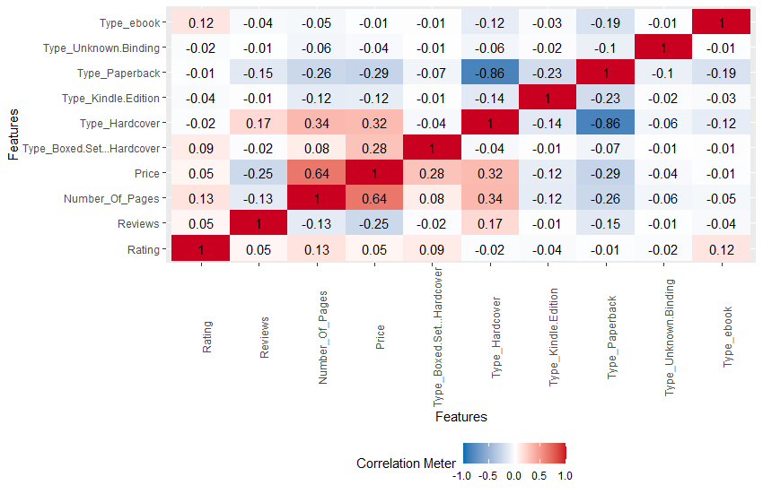

# R-Assignment 4

**Created by Nutwara Boonyangkongkaew (ID: 63130500035)**

Choose Dataset:
Top 270 Computer Science / Programing Books (Data from Thomas Konstantin, [Kaggle](https://www.kaggle.com/thomaskonstantin/top-270-rated-computer-science-programing-books)) >> [Using CSV](https://raw.githubusercontent.com/safesit23/INT214-Statistics/main/datasets/prog_book.csv)


### Outlines
1. Explore the dataset
2. Learning function from Tidyverse
3. Transform data with dplyr and finding insight the data
4. Visualization with GGplot2


## Part 1: Explore the dataset

```
# Install the packages
install.packages("dplyr", "readr", "DescTools", "assertive", "stringr", "ggplot2", "DataExplorer", "tidyverse", "forcats")  

# Activate the packages
library(dplyr)
library(readr)
library(DescTools)
library(assertive)
library(stringr)
library(ggplot2)
library(DataExplorer)                        
library(tidyverse)                          
library(forcats)

# Load dataset
comsci <- read_csv("https://raw.githubusercontent.com/safesit23/INT214-Statistics/main/datasets/prog_book.csv")
```


In this dataset has a list of 270 books in the field of computer science and programming related topics.<br>
with rating, reviews, book title, description, number of pages, type, and price that dataset has 271 rows 7 columns.<br>

The list of books was constructed using many popular websites <br>
which provide information on book ratings of all the book in those websites the 270 most popular were selected.<br>

// ### 🎸🥁 Team: K-on 🎸🥁
| No. | Column              | Category   |
|:---:|-------------------|--------------|
|1.   |Rating| double|
|2.   |Reviews |number|
|3.   |Book_title| character|
|4.   |Description |character|
|5.   |Number_Of_Pages |double|
|6.   |Type |character|
|7.   |Price |double|


```
# see dataset overview 'comsci'     
glimpse(comsci)     # preview the dataset
summary(comsci)     # result summaries of various model fitting functions  
introduce(comsci)   # explain the details of the data set 
```
result
```
Rows: 271
Columns: 7
$ Rating          <dbl> 4.17, 4.01, 3.33, 3.97, 4.06, 3.84, 4.09, 4.15, 3.87, 4.62, 4.03, 3.78, 3.73, 3.87, 3.87, 3.95, 3.8~
$ Reviews         <dbl> 3829, 1406, 0, 1658, 1325, 117, 5938, 1817, 2093, 0, 160, 481, 33, 1255, 593, 417, 80, 279, 370, 20~
$ Book_title      <chr> "The Elements of Style", "The Information: A History, a Theory, a Flood", "Responsive Web Design Ov~
$ Description     <chr> "This style manual offers practical advice on improving writing skills. Throughout, the emphasis is~
$ Number_Of_Pages <dbl> 105, 527, 50, 393, 305, 288, 256, 368, 259, 128, 352, 352, 200, 328, 240, 288, 392, 304, 336, 542, ~
$ Type            <chr> "Hardcover", "Hardcover", "Kindle Edition", "Hardcover", "Kindle Edition", "Paperback", "Hardcover"~
$ Price           <dbl> 9.323529, 11.000000, 11.267647, 12.873529, 13.164706, 14.188235, 14.232353, 14.364706, 14.502941, 1~

     Rating         Reviews        Book_title        Description        Number_Of_Pages      Type               Price        
 Min.   :3.000   Min.   :   0.0   Length:271         Length:271         Min.   :  50.0   Length:271         Min.   :  9.324  
 1st Qu.:3.915   1st Qu.:   5.5   Class :character   Class :character   1st Qu.: 289.0   Class :character   1st Qu.: 30.751  
 Median :4.100   Median :  35.0   Mode  :character   Mode  :character   Median : 384.0   Mode  :character   Median : 46.318  
 Mean   :4.067   Mean   : 185.6                                         Mean   : 475.1                      Mean   : 54.542  
 3rd Qu.:4.250   3rd Qu.: 116.5                                         3rd Qu.: 572.5                      3rd Qu.: 67.854  
 Max.   :5.000   Max.   :5938.0                                         Max.   :3168.0                      Max.   :235.650  

# A tibble: 1 x 9
   rows columns discrete_columns continuous_columns all_missing_columns total_missing_values complete_rows total_observations memory_usage
  <int>   <int>            <int>              <int>               <int>                <int>         <int>              <int>        <dbl>
1   271       7                3                  4                   0                    0           271               1897       163072
```


### Explore dataset with graphs in RStudio.

#### Dataset details
```
comsci %>% plot_intro()
```
<p align="center">
  
</p>

<p align="center">รูปที่ 1 คำอธิบายชุดข้อมูล
</p>

จากกราฟเห็นได้ว่า
- variable ข้อมูลแบบไม่ต่อเนื่อง --> 43%  
- variable ข้อมูลแบบต่อเนื่อง --> 57%
- column ทั้งหมดมี missing values --> 0%
- จำนวน row / ข้อมูลสมบูรณ์ --> 100% 
- missing observation value ขาดหายไป --> 0%

แสดงว่า ไม่มีการสูญหายของชุดข้อมูล / ชุดข้อมูลครบถ้วนสมบูรณ์

#### Check the distribution and density of the data.
#### For numeric variables

```
comsci %>% plot_density()
comsci %>% plot_histogram()  
```
<p align="center">

</p>

<p align="center">
รูปที่ 2 กราฟแสดงการกระจายของข้อมูลด้วย density plot
</p>

<p align="center">

</p>

<p align="center">
รูปที่ 3 กราฟแสดงการกระจายของข้อมูลด้วย histogram plot
</p>

#### For character variables 
only retrieve columns >= 50 categories.
```
comsci %>% plot_bar() 
```

<p align="center">

</p>

<p align="center">
รูปที่ 4 กราฟแท่งแสดงปริมาณของข้อมูลเชิงคุณภาพ
</p>


#### Finding Relationships

```
comsci %>% plot_correlation() 
```

<p align="center">

</p>

<p align="center">
รูปที่ 5 กราฟแสดงความสัมพันธ์ของชุดข้อมูล
</p>

Non-numeric group data cannot be correlated.

--> use one-hot encoding.

--> making it possible to see all the relationships of various variable.


## Part 2: Learning function from Tidyverse

- Function `select()` from package [dplyr](https://dplyr.tidyverse.org/articles/dplyr.html#select-columns-with-select)). It using for select columns

```
starwars %>% select(name,height)
```
** You can sepearate this part or combine in part of `Transform data with dplyr and finding insight the data`

## Part 3: Transform data with dplyr and finding insight the data

//Explain here

```
#Code here
```

Result:

```
#Copy Result from console to here
```
//Explain

- list 1
- list 2

## Part 4: Visualization with GGplot2
### 1.) Graph show relation between height and mass
```
scat_plot <- starwars %>% filter(mass<500) %>% ggplot(aes(x=height,y=mass))+
  geom_point(aes(color=gender))

scat_plot+geom_smooth()
```
Result:


**Guideline:
Embed Image by using this syntax in markdown file
````

````
